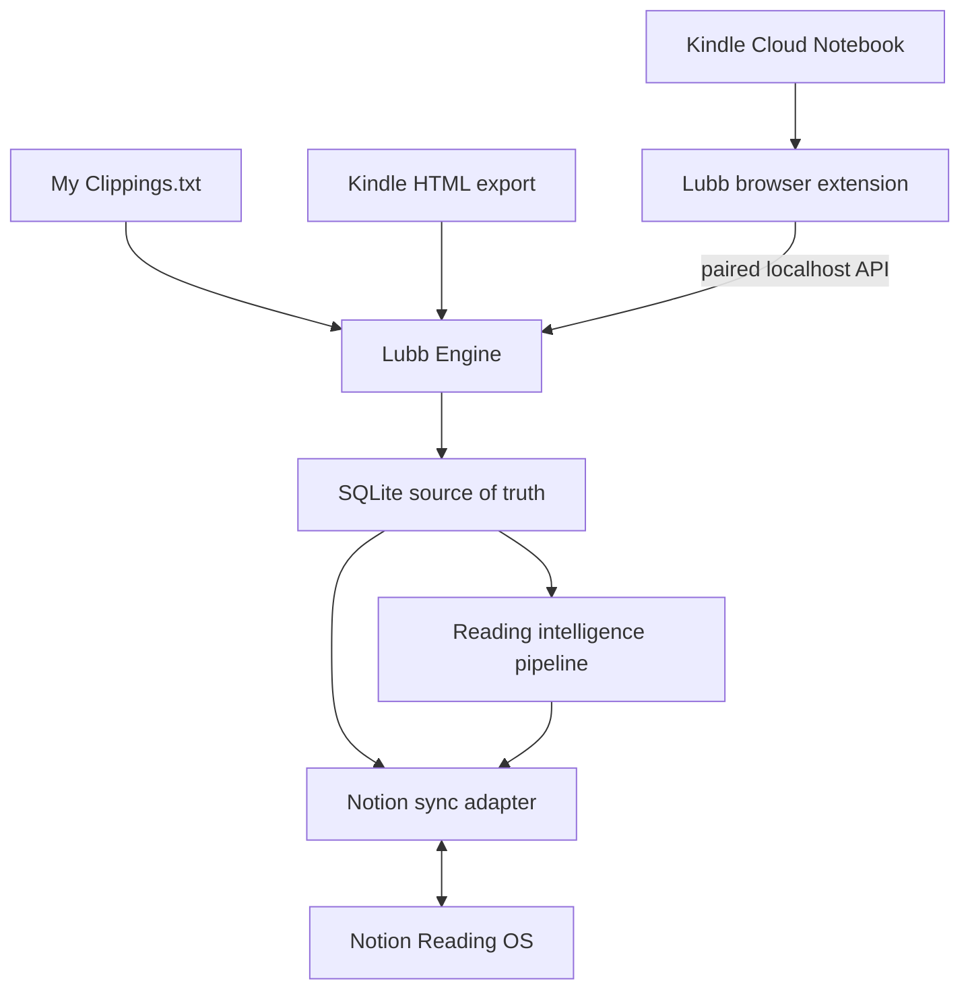

# Lubb (لُبّ): Product and Architecture Plan

Version: 1.0  
Date: 2026-08-23  
Purpose: Personal Kindle-to-Notion reading intelligence system for Yusuf Naeem

## 1. Product decision

### Name

**Lubb — لُبّ**

`Lubb` means the core, essence, or deepest understanding of something. The name fits the product better than a name focused only on highlighting: the system should extract the essence of reading, connect it to Yusuf's learning paths, test understanding, and turn ideas into action.

Working tagline:

> From Kindle highlights to understanding you can use.

### Product promise

Lubb reliably imports Yusuf's complete available Kindle annotation history, preserves the source exactly, organizes it in Notion, and helps transform selected highlights into concepts, durable insights, reviews, and applications.

### Definition of “full sync”

Full sync does **not** mean writing edits back into Kindle. Amazon does not expose a supported public annotation API for this.

For Lubb, full sync means:

1. Kindle Cloud Notebook annotations automatically flow into Lubb.
2. `My Clippings.txt` and Kindle HTML exports fill cloud coverage gaps.
3. Lubb deduplicates records across all Kindle sources.
4. Lubb creates and updates the corresponding Notion records.
5. User-owned fields edited in Notion flow back into Lubb.
6. Lubb never overwrites user thinking with a later Kindle or AI sync.
7. Deletions are soft and recoverable.
8. Every sync produces an auditable report.

The system is therefore:

- Kindle → Lubb: source synchronization
- Lubb ↔ Notion: controlled bidirectional synchronization
- Lubb → AI drafts: optional enrichment
- Notion → Yusuf: primary daily reading intelligence interface

## 2. Best and easiest architecture

### Decision: local-first engine plus browser extension

For personal usage, the best balance of simplicity, privacy, reliability, and cost is:

1. A Chromium Manifest V3 extension that reads Kindle using Yusuf's already-authenticated Amazon browser session.
2. A small local Lubb Engine bound to `127.0.0.1`.
3. A local SQLite database as the authoritative record and synchronization ledger.
4. A Notion integration used by the engine.
5. An optional OpenAI API connection used by the engine for structured intelligence drafts.
6. Notion as the mobile-friendly and desktop-friendly thinking interface.

No hosted Lubb account, cloud database, Redis instance, or third-party queue is required for V1.



### Why this approach

- Amazon credentials and session cookies never leave the browser.
- Notion and OpenAI secrets stay on Yusuf's computer.
- The browser is already required for automatic Kindle sync, so a cloud daemon would not provide true background synchronization without assuming possession of the Amazon session.
- SQLite is sufficient for a single-user reading library and makes backups trivial.
- Notion remains accessible on Android and every other device even while the engine is offline.
- A future hosted mode can reuse the domain model and adapters without redesigning the product.

### Honest automation boundary

Automatic Kindle synchronization runs while Chrome or Edge is available and Yusuf's Amazon session remains valid. The extension performs a catch-up run at browser startup. If the local engine is offline, the extension retains a bounded local job envelope containing only parsed annotations, never Amazon cookies, and retries when the engine returns. Encrypt that envelope when the browser platform provides a suitable local key; otherwise minimize its contents and lifetime.

## 3. Repository and technology design

Use a TypeScript monorepo with pnpm workspaces.

```text
lubb/
├── AGENTS.md
├── README.md
├── package.json
├── pnpm-workspace.yaml
├── apps/
│   ├── engine/                 # Local API, worker, CLI, setup and health UI
│   └── extension/              # Chromium Manifest V3 Kindle connector
├── packages/
│   ├── domain/                 # Entities, IDs, normalization and invariants
│   ├── kindle-import/          # Cloud, Clippings and HTML parsers
│   ├── notion-sync/            # Schema, ownership and adapter
│   ├── intelligence/           # AI pipeline and deterministic safeguards
│   ├── prompts/                # Versioned application prompt registry
│   ├── test-fixtures/          # Sanitized Kindle/Notion fixtures
│   └── config/                 # Shared TS, lint and test config
├── docs/
│   ├── architecture.md
│   ├── data-contract.md
│   ├── notion-setup.md
│   ├── sync-semantics.md
│   ├── security.md
│   └── decisions/
├── scripts/
└── evals/
```

Recommended implementation characteristics:

- TypeScript strict mode
- Node.js LTS
- SQLite with migrations and WAL mode
- A lightweight HTTP framework for the local engine
- Zod or equivalent runtime validation at every boundary
- A current Manifest V3 extension framework only if it reduces boilerplate without obscuring permissions or network behavior
- Vitest or an equivalent fast unit-test runner
- Playwright for extension and Notion-adapter integration tests where practical
- Dependency injection around Amazon, Notion, clock, hashing, and AI clients
- Structured JSON logs with secret redaction

Do not choose a large distributed stack for V1.

## 4. Core domain model

### Account

- `id`
- `amazonRegion`
- `amazonAccountFingerprint` (non-secret, locally derived)
- `notionWorkspaceId`
- `createdAt`

### Book

- `id` — internal immutable UUID
- `sourceBookKey` — namespaced stable key
- `asin`
- `sourceTitle`
- `displayTitle`
- `author`
- `coverUrl`
- `sourceUrl`
- `lastAnnotatedAt`
- `sourceKinds[]`
- `sourceState`
- `firstSeenAt`
- `lastSeenAt`

Identity priority:

1. Amazon region + ASIN
2. Reliable document identifier
3. ISBN
4. Normalized title + normalized author
5. User-confirmed fuzzy match

### Annotation

- `id` — internal immutable UUID
- `bookId`
- `sourceAnnotationKey`
- `sourceKind` — `kindle_cloud`, `my_clippings`, `kindle_html`
- `type` — `highlight`, `note`, `bookmark`
- `rawText`
- `normalizedText`
- `sourceNote`
- `locationStart`
- `locationEnd`
- `page`
- `chapter`
- `color`
- `annotatedAt`
- `firstImportedAt`
- `lastSeenAt`
- `sourceState`
- `contentLimitState`
- `rawPayloadHash`

Preferred annotation identity:

1. Amazon-native annotation identifier when available
2. Region + ASIN + annotation type + location range
3. Book + location overlap + text similarity + date compatibility

Text alone must never be the primary identity.

### AnnotationUserState

Kept separate from the source snapshot:

- `annotationId`
- `processingStatus`
- `importance`
- `personalInterpretation`
- `agreement`
- `userTags[]`
- `notionPageId`
- `notionLastPulledAt`
- `userLockedFields[]`

### IntelligenceDraft

- `id`
- `annotationId` or `bookId`
- `taskType`
- `promptVersion`
- `model`
- `inputHash`
- `structuredOutput`
- `confidence`
- `groundingWarnings[]`
- `status` — `draft`, `approved`, `rejected`, `stale`
- `createdAt`

### SyncRun and SyncEvent

Every run records:

- connector
- start/end time
- checkpoint
- books discovered
- pages fetched
- records created/updated/missing/ambiguous
- retries and errors
- parser version
- completion and validation status

## 5. Import pipeline

### Cloud Notebook connector

1. Detect the configured Amazon region.
2. Verify the user is authenticated without reading or exporting cookie values.
3. Fetch the library with authenticated browser requests.
4. Discover all books, not only the initially rendered list.
5. Prioritize books whose `lastAnnotatedAt` changed.
6. Fetch each changed book and follow Amazon's annotation pagination tokens.
7. Parse into an adapter-specific intermediate schema.
8. Validate counts and pagination completion.
9. Send normalized import envelopes to the local engine.
10. Commit a book snapshot only after the complete book passes validation.

### Incremental schedule

- On extension startup: catch-up check
- Every six hours while the browser is running: recent-book check
- Weekly: integrity scan
- Monthly: complete library reconciliation
- Manual: `Sync now`, `Sync selected books`, and `Full resync`

### Offline import connectors

`My Clippings.txt` and Kindle HTML are parsed in the engine using the same intermediate schema and reconciliation service as the cloud connector.

### Deletion policy

An annotation missing from a single source run is never deleted.

It becomes `source_missing` only after a complete successful snapshot. It becomes `confirmed_missing` after two complete snapshots. The Notion record is marked but not trashed. Permanent deletion is a separate user action.

### Required sync safety gates

A source snapshot cannot commit when:

- Amazon returned a login, CAPTCHA, or consent page
- no book identity was found
- annotation count reconciliation failed materially
- pagination did not terminate cleanly
- a previously populated library unexpectedly became empty
- parser confidence fell below the configured threshold

## 6. Notion Reading OS

Notion is the primary user interface, but not the authoritative source snapshot.

### Database 1: Books

| Property | Type | Owner | Purpose |
| --- | --- | --- | --- |
| Name | Title | User after creation | Preferred display title |
| Source Title | Rich text | Lubb | Exact Kindle title |
| Lubb Book ID | Rich text | Lubb | Immutable sync key |
| ASIN | Rich text | Lubb | Amazon identifier |
| Author | Rich text | Lubb | Source author |
| Cover | Files/URL | Lubb | Cover image |
| Kindle URL | URL | Lubb | Source/deep link |
| Last Annotated | Date | Lubb | Kindle activity |
| Source State | Status | Lubb | Active, limited, missing |
| Reading Status | Status | User | Queue, reading, finished, paused |
| Rating | Number | User | Personal rating |
| Learning Paths | Relation | User | Curricula association |
| Highlights | Relation | Lubb | Imported annotations |
| Highlight Count | Rollup | Derived | Count |
| Synthesis Status | Status | User | Not started, draft, approved |
| Last Synced | Date | Lubb | Operational visibility |

### Database 2: Highlights

| Property | Type | Owner | Purpose |
| --- | --- | --- | --- |
| Name | Title | Lubb | Short deterministic excerpt |
| Lubb Annotation ID | Rich text | Lubb | Immutable sync key |
| Book | Relation | Lubb | Parent book |
| Highlight | Rich text/page body | Lubb | Exact source text |
| Kindle Note | Rich text/page body | Lubb | Exact source note |
| Type | Select | Lubb | Highlight, note, bookmark |
| Location | Rich text | Lubb | Kindle location |
| Page | Number/text | Lubb | Printed page when available |
| Chapter | Rich text | Lubb | Chapter when available |
| Color | Select | Lubb | Kindle color |
| Annotated At | Date | Lubb | Source date |
| Source | Select | Lubb | Cloud, clippings, HTML |
| Source State | Status | Lubb | Active, limited, missing |
| Process Status | Status | User | Inbox, processed, discarded |
| Importance | Select | User | Low, medium, high, essential |
| My Interpretation | Rich text | User | Yusuf's explanation |
| Agreement | Select | User | Agree, unsure, disagree |
| Suggested Claim | Rich text | AI draft | Grounded proposed claim |
| Suggested Questions | Page body | AI draft | Recall/reflection questions |
| Concepts | Relation | User/approved AI | Knowledge connections |
| Applications | Relation | User | Real usage |
| AI Locked | Checkbox | User | Prevent refresh |
| Last Synced | Date | Lubb | Operational visibility |

### Database 3: Concepts

- Name
- Lubb Concept ID
- Working Definition
- My Understanding
- Status: Emerging, Active, Stable, Challenged, Archived
- Highlights relation
- Books relation/rollup
- Learning Paths relation
- Supporting Insights relation
- Contradicting Insights relation
- Open Questions
- Mastery score
- Last Reviewed

### Database 4: Insights

An Insight is Yusuf's durable idea, not a copied quotation.

- Name
- Lubb Insight ID
- Claim
- Explanation in My Words
- Evidence
- Counterevidence
- My Position
- Confidence
- Stage: AI Draft, Reviewing, Approved, Challenged, Archived
- Source Highlights relation
- Concepts relation
- Books rollup
- Learning Paths relation
- Applications relation
- Created/Reviewed dates

### Database 5: Learning Paths

- Name
- Priority: Primary, Secondary, Light
- Status
- Purpose
- Target Outcomes
- Books relation
- Concepts relation
- Insights relation
- Current Topic
- Weekly Review Day
- Progress and coverage rollups

Initial paths can include Staff Software Engineering, Yusuf's second primary path, Wealth as a lighter weekly path, and Islamic Learning as a separate curriculum.

### Database 6: Reviews

- Name
- Review Type: Daily Recall, Weekly Synthesis, Book Completion, Path Examination
- Scheduled Date
- Completed Date
- Status
- Highlights/Concepts/Books relations
- Questions
- Yusuf's Answers
- Recall Score
- Gaps
- Next Review

### Database 7: Applications

- Name
- Insight relation
- Project/Area
- Hypothesis
- Planned Action
- Target Date
- Review Date
- Expected Result
- Actual Result
- Outcome
- Evidence
- Follow-up

### Views Yusuf creates in Notion

The Notion API does not currently manage database views, so Lubb should create schemas and provide a guided checklist or a duplicable template for views.

Required dashboard views:

- Highlight Inbox
- Currently Reading
- Active Learning Paths
- Concepts Needing Attention
- AI Drafts Awaiting Approval
- Weekly Review
- Applications Awaiting Evaluation
- Export-Limited or Sync-Problem Books

## 7. Field ownership and two-way sync

### Ownership classes

**Source-owned**

Identifiers, raw highlight, Kindle note, location, page, color, source timestamps, source state.

**User-owned**

Display title, process status, importance, interpretation, agreement, rating, learning paths, approvals, personal definitions, application outcomes.

**AI-draft-owned**

Suggested claim, suggested questions, suggested classifications, unapproved synthesis. AI can update these only when `AI Locked` is false and the input hash changed.

**Derived**

Rollups, formulas, counts and computed health fields.

### Reconciliation order

For every Notion sync:

1. Pull changed Notion pages and copy only user-owned fields into SQLite.
2. Resolve conflicts using property ownership and latest valid user edit.
3. Apply Kindle source changes to source-owned fields.
4. Apply new AI drafts to unlocked AI fields.
5. Upsert Notion pages by immutable Lubb IDs.
6. Verify the written page and record its resulting edit time.

The engine must not use whole-page replacement for mixed-ownership content.

### Notion operational constraints

- Pace requests below Notion's connection limit and honor `Retry-After`.
- Use a durable SQLite job table with retry count, next-attempt time and idempotency key.
- Batch reads and minimize relation lookups.
- Treat webhook support as a future hosted-mode optimization. V1 polls `last_edited_time` during each local run.
- Pin and test a specific Notion API version.

## 8. Reading intelligence pipeline

AI never modifies raw source text. It creates reviewable drafts.

### Pipeline stages

1. Deterministic quality checks
2. Annotation classification
3. Claim extraction
4. Recall/reflection question generation
5. Candidate concept retrieval
6. Connection and contradiction suggestions
7. Book synthesis
8. Learning-path synthesis
9. Application suggestion
10. Human approval in Notion

### Global grounding contract

Every intelligence prompt must enforce:

- Separate author claims, Yusuf's words, and model inference.
- Never invent book context not present in supplied evidence.
- Quote only supplied highlight text.
- Return structured JSON matching a versioned schema.
- Represent uncertainty explicitly.
- Preserve English and Arabic correctly.
- Avoid generic motivational advice.
- Prefer one strong connection over many weak ones.
- Treat religious content with source-sensitive caution and no fabricated rulings.

### Application prompt registry

Store prompts as versioned files, not inline strings:

```text
packages/prompts/
├── system/
│   └── reading-grounding.v1.md
├── annotation/
│   ├── classify.v1.md
│   ├── claim.v1.md
│   └── questions.v1.md
├── concept/
│   ├── connect.v1.md
│   └── contradiction.v1.md
├── synthesis/
│   ├── book.v1.md
│   └── weekly-path.v1.md
└── application/
    └── experiment.v1.md
```

Each prompt version must have:

- JSON Schema
- golden fixtures
- groundedness checks
- bilingual fixture coverage
- regression score
- migration rule for stale drafts

## 9. Security model

- Bind the engine only to `127.0.0.1` by default.
- Pair the extension with a random high-entropy token.
- Allow only the installed extension origin and local setup UI.
- Do not expose Amazon cookies through the extension API.
- Never log Notion/OpenAI secrets or raw authentication headers.
- Store secrets in an OS credential store when packaging; use a restricted local `.env` only during development.
- Redact raw annotations from diagnostic exports unless Yusuf explicitly includes them.
- Use minimum extension host permissions, requested per configured Amazon region.
- Provide complete JSON/Markdown backup and restore.
- Support token rotation without rebuilding the database.

## 10. Delivery phases and acceptance criteria

### Phase 0: Evidence and contracts

Deliver:

- Fixture corpus
- Domain schema
- sync semantics
- identifier and dedupe evaluation harness
- architectural decision records

Exit criteria:

- Reimporting every fixture produces zero duplicates.
- Same quotation at different locations remains two annotations.
- Cloud and clipping versions reconcile when evidence is sufficient.

### Phase 1: Local engine and offline importer

Deliver:

- SQLite engine
- migrations
- local API and pairing
- `My Clippings.txt` and Kindle HTML import
- sync report

Exit criteria:

- Restart-safe imports
- transaction rollback on invalid input
- backup/restore test

### Phase 2: Cloud extension

Deliver:

- regional setup
- manual and scheduled cloud sync
- pagination and checkpoints
- session-expiry handling
- validation gates

Exit criteria:

- No credential export
- full fixture library import
- interrupted run resumes safely
- failed parse cannot mark annotations deleted

### Phase 2B: Live importer verification

Deliver:

- Controlled live-library test plan
- redacted importer artifacts
- parser coverage and reconciliation scorecard
- documented markup variants and recovery behavior

Exit criteria:

- A complete live library sync reconciles against Kindle's visible totals.
- Pagination, notes, highlights, and book boundaries are verified.
- A repeated live sync creates zero duplicates.
- Session expiry and unexpected markup produce actionable reports, not silent data loss.

### Phase 3: Notion schema provisioner

Deliver:

- schema provisioner
- ID mapping
- setup checklist/template

Exit criteria:

- Every required data source and relation is created idempotently.
- Re-running setup repairs compatible drift without deleting user content.
- Unsupported view creation is represented by a clear manual setup checklist.

### Phase 4: Controlled two-way Notion sync

Deliver:

- property ownership registry
- pull, reconcile, and push pipeline
- request pacing, retries, and resumable jobs
- drift and conflict reporting

Exit criteria:

- Notion user edits survive repeated Kindle syncs
- all upserts are idempotent
- rate-limit tests pass
- relations remain valid

### Phase 5: Reading intelligence

Deliver:

- versioned prompt registry
- annotation drafts
- concept suggestions
- questions and book synthesis
- approval workflow

Exit criteria:

- raw source remains byte-for-byte unchanged
- outputs pass schema validation
- groundedness eval passes threshold
- Arabic and English fixtures pass

### Phase 6: Notion workflows and review experience

Deliver:

- Highlight Inbox workflow
- book synthesis and concept review workflows
- learning paths, reviews, and applications
- dashboard formulas and manual view recipe

Exit criteria:

- A new highlight can move from capture to approved insight without editing source fields.
- Weekly review surfaces due concepts and unfinished applications.
- AI drafts are visibly distinguishable from approved knowledge.
- All workflows remain useful when the local engine is temporarily offline.

### Phase 7: Hardening and packaging

Deliver:

- installer/startup configuration
- health dashboard
- update and rollback plan
- export/import
- end-to-end runbook

Exit criteria:

- clean-machine installation documented
- complete end-to-end test passes
- recovery drill passes
- no high-severity security findings remain

## 11. Non-goals for V1

- Writing edits back to Kindle
- Extracting unhighlighted copyrighted book text
- Bypassing publisher clipping limits
- Multi-user accounts
- Public SaaS billing
- Native mobile application
- Supporting every reading platform before Kindle is reliable
- Fully autonomous publication of AI-generated insights

## 12. Final build principle

Reliability is the feature. Lubb should prefer an honest incomplete sync with a precise report over a seemingly complete sync that silently duplicates, truncates, overwrites, or deletes Yusuf's reading history.
