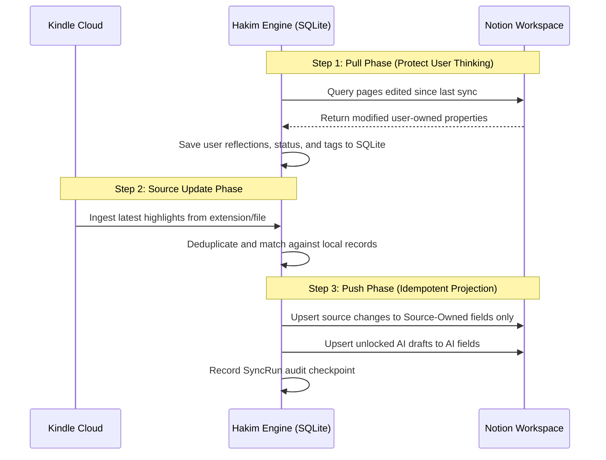

# Sync Semantics & Field Ownership: Hakim (حَكِيم)

## Ownership Matrix

| Field Category | Properties Included | Authoritative Source | Overwrite Policy |
| :--- | :--- | :--- | :--- |
| **Source-Owned** | `rawText`, `sourceNote`, `locationStart`, `locationEnd`, `page`, `chapter`, `color`, `annotatedAt`, `sourceState` | Kindle (Cloud, Clippings, HTML) | Updated automatically when Kindle source changes. Never editable in Notion. |
| **User-Owned** | `displayTitle`, `processStatus`, `importance`, `personalInterpretation`, `agreement`, `rating`, `readingStatus`, `userTags`, `concept definitions`, `action outcomes` | User (Notion, Obsidian, Engine) | User edits always supersede. Kindle re-syncs will NEVER overwrite these. |
| **AI-Draft-Owned** | `suggestedClaim`, `suggestedQuestions`, `candidateConcepts`, `bookSynthesis` | Reading Intelligence Pipeline | Replaced only if `AI Locked` is false and input text hash has changed. |
| **Derived** | `highlightCount`, `lastSynced`, `healthStatus`, `masteryScore` | Hakim Engine | Computed dynamically by engine/database rollups. |

## Reconciliation Workflow (Notion 2-Way Sync)

## Deletion and Missing Item Policy

- Single Sync Absence: If an annotation is missing from a single Cloud sync, mark as `source_missing`.
- Two Confirmed Absences: Mark as `confirmed_missing`.
- **Zero Automated Hard Deletions**: Local records and Notion pages are never permanently deleted automatically. Permanent removal requires explicit user deletion in Hakim.
